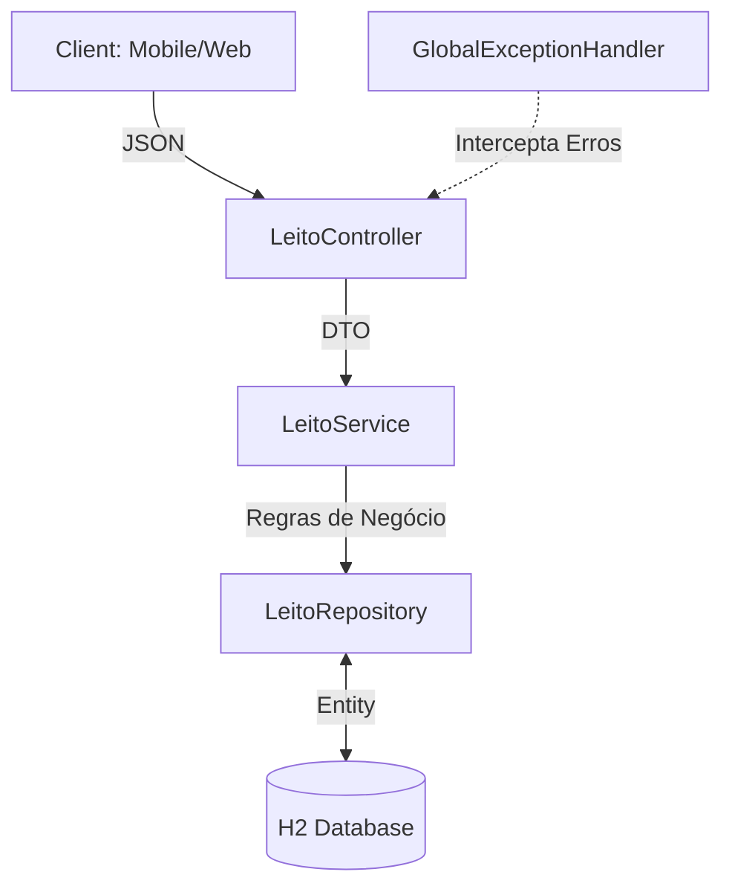

## 🚀 Diferenciais Técnicos (O que há sob o capô)

Diferente de um CRUD básico, esta API implementa padrões arquiteturais de nível enterprise:

* **Arquitetura em Camadas:** Separação clara entre Controller (Interface), Service (Business Logic) e Repository (Data Access).
* **Global Exception Handling:** Tratamento centralizado de erros, garantindo que o cliente da API (Mobile/Web) receba mensagens claras e códigos HTTP semânticos (400, 409, 500).
* **Data Integrity:** Restrições de unicidade e validações no nível de banco de dados e aplicação.
* **Offline Simulation:** Configurada com banco de dados em memória (H2) para prototipagem rápida e testes de integração.

## 🛠 Tech Stack

* **Linguagem:** Kotlin 2.2+ (Utilizando expressividade e Null-Safety)
* **Framework:** Spring Boot 4.0.1
* **Persistência:** Spring Data JPA / Hibernate
* **Banco de Dados:** H2 Database (In-memory)
* **Documentação:** OpenAPI 3 / Swagger UI
* **Gerenciador de Dependências:** Maven

## 🏗 Arquitetura do Projeto


Regras de Negócio Implementadas

* **Unicidade de Identificador**: Não é permitido o cadastro de dois leitos com o mesmo código identificador.
* **Segurança Operacional**: O sistema impede a alocação de pacientes em leitos que possuam o status MANUTENCAO.
* **Filtragem Inteligente**: Endpoints específicos para consulta de disponibilidade imediata.

⚡ Como Rodar o Projeto

    Certifique-se de ter o JDK 24 (ou compatível) instalado.
    Clone o repositório.
    No terminal, na raiz do projeto, execute:
    Bash
    ./mvnw spring-boot:run
    A API estará disponível em: http://localhost:8080/swagger-ui/index.html

📖 Documentação da API (Swagger)

Com a aplicação rodando, acesse a documentação interativa para testar os endpoints: 👉 http://localhost:8080/swagger-ui.html

Desenvolvido por Daniel Faria Engenheiro de Software focado em soluções escaláveis e arquitetura limpa.

## 🧪 Testes Unitários
O projeto conta com suite de testes automatizados utilizando **JUnit 5**, garantindo que as regras de negócio críticas (como a trava de manutenção) permaneçam íntegras durante a evolução do código.

## 🐳 Dockerização
Aplicação containerizada para facilitar o deploy e garantir paridade entre ambientes:
```bash
docker build -t hospital-api .
docker run -p 8080:8080 hospital-api
```
---
